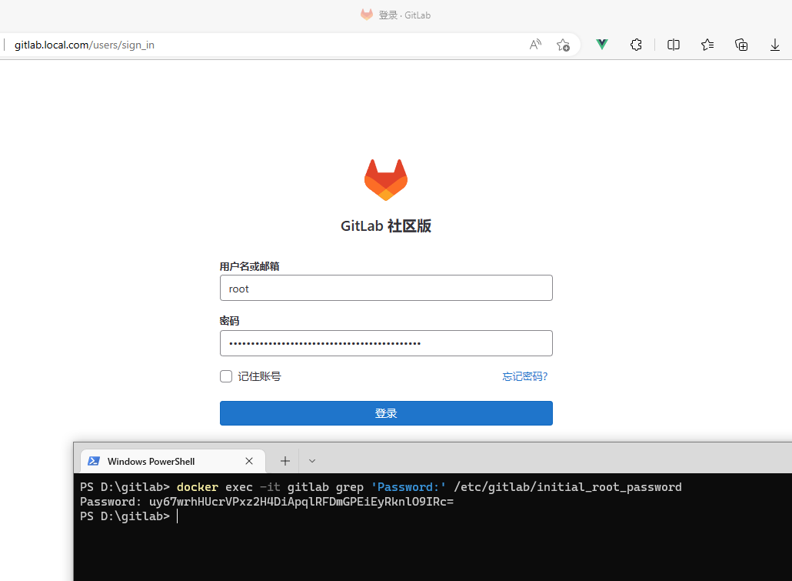

[GitLab](https://gitlab.cn/) 是一个用于仓库管理系统的开源项目，使用Git作为代码管理工具，并在此基础上搭建起来的web服务。

GitLab是由GitLabInc.开发，使用MIT许可证的基于网络的Git仓库管理工具，且具有wiki和issue跟踪功能。使用Git作为代码管理工具，并在此基础上搭建起来的web服务。

GitLab由乌克兰程序员 `DmitriyZaporozhets和ValerySizov` 开发，它使用Ruby语言写成。后来，一些部分用Go语言重写。截止2018年5月，该公司约有290名团队成员，以及2000多名开源贡献者。


## 系统要求

- 如果用于小团队项目，最低要求使用 2核 CPU 及 2GB 内存
- 如果要支持 500 人的团队，最低要求使用 4核 CPU 及 4GB 内存
- 如果要支持 1000 人的团队，最低要求使用 8核 CPU 及 8GB 内存


## 版本说明

GitLab是建立在开放核心模型之上的， 这意味着GitLab有两个版本: 社区版（CE） 和 [企业版（EE）](https://about.gitlab.com/pricing/)。

- GitLab Community Edition 是开放源码的，拥有MIT的外籍许可证。
- GitLab Enterprise Edition 构建在 Community Edition 之上，它使用相同的核心，但在此基础上添加了其他特性和功能。这是在专有许可下进行的。

这里建议安装企业版：**企业版拥有社区版发行版中的所有相同功能，如果后续想使用企业版的付费功能，只需简单的操作即可使用。免除了从社区版到企业版的升级过程**。


## 安装

GitLab 提供了多种安装方式：

  - [使用 Docker 安装](#使用-docker-安装)
  - [使用包管理器安装](#使用包管理器安装)

更多安装方式参见：[https://docs.gitlab.com/ee/install/install_methods.html](https://docs.gitlab.com/ee/install/install_methods.html)


### 使用 Docker 安装

GitLab 官方 Docker 镜像：

- 社区版：[https://hub.docker.com/r/gitlab/gitlab-ce/](https://hub.docker.com/r/gitlab/gitlab-ce/)
- 企业版：[https://hub.docker.com/r/gitlab/gitlab-ee/](https://hub.docker.com/r/gitlab/gitlab-ee/)


```sh
docker run --detach \
  --hostname gitlab.local.com \
  --publish 443:443 --publish 80:80 --publish 22:22 \
  --name gitlab \
  --restart always \
  --env GITLAB_OMNIBUS_CONFIG="external_url 'http://gitlab.local.com';" \
  --volume /home/gitlab/config:/etc/gitlab \
  --volume /home/gitlab/logs:/var/log/gitlab \
  --volume /home/gitlab/data:/var/opt/gitlab \
  --shm-size 256m \
  gitlab/gitlab-ce:latest
```

或者使用 `Docker Compose`，将以下内容写入 `docker-compose.yml` 文件：
```yml
version: '3.9'
services:
  web:
    image: 'gitlab/gitlab-ce:latest'
    restart: always
    container_name: gitlab
    hostname: 'gitlab.local.com'
    environment:
      GITLAB_OMNIBUS_CONFIG: |
        external_url 'http://gitlab.local.com'
        # Add any other gitlab.rb configuration here, each on its own line
    ports:
      - '80:80'
      - '443:443'
      - '22:22'
    volumes:
      - '/home/gitlab/config:/etc/gitlab'
      - '/home/gitlab/logs:/var/log/gitlab'
      - '/home/gitlab/data:/var/opt/gitlab'
    shm_size: '256m'
```
然后进入 `docker-compose.yml` 所在目录，运行 `docker-compose up -d` 启动 GitLab。

> 如果要使用企业版，请将 `gitlab-ce` 替换成 `gitlab-ee`。


这将下载并启动 GitLab 容器并发布所需的端口 访问SSH，HTTP和HTTPS。所有 GitLab 数据都将存储为 `/home/gitlab` 的子目录。容器将在系统重新启动后自动运行。

初始化过程可能需要很长时间。您可以使用以下命令跟踪处理方式：

```sh
sudo docker logs -f gitlab
```

启动容器后，您可以访问 GitLab URL： `gitlab.local.com`。

并使用以下命令获取 `root` 用户的初始登录密码：
```sh
sudo docker exec -it gitlab grep 'Password:' /etc/gitlab/initial_root_password
```
> 注意：密码文件将在 24 小时后的第一次重新配置运行中自动删除。



<br><br>

### 使用包管理器安装

#### Ubuntu/Debian

系统版本 `Ubuntu 18.04 LTS` `Ubuntu 20.04 LTS` `Debian 9` `Debian 10` `Debian 11`.

1. 安装和配置必须的依赖项

```sh
sudo apt-get update
sudo apt-get install -y curl openssh-server ca-certificates tzdata perl
```

（可选）下一步，安装 `Postfix` 以发送电子邮件通知。如果您想使用其他解决方案发送电子邮件，请跳过此步骤并在安装 GitLab 后配置外部 SMTP 服务器。
```sh
sudo apt-get install -y postfix
```
在安装 `Postfix` 的过程中可能会出现一个配置界面，在该界面中选择 “Internet Site” 并按下回车。把 “mail name” 设置为您服务器的外部 DNS 域名并按下回车。如果还有其它配置界面出现，继续按下回车以接受默认配置。


2. 下载/安装 GitLab

配置 GitLab 软件源镜像:
```sh
curl -fsSL https://packages.gitlab.cn/repository/raw/scripts/setup.sh | /bin/bash
```
接下来，安装 GitLab。确保您已正确设置您的 DNS，并更改 `https://gitlab.local.com` 为您要访问 GitLab 实例的 URL。安装包将在该 URL 上自动配置和启动 GitLab。

对于 https 站点，GitLab 将使用 Let's Encrypt 自动请求 SSL 证书，这需要有效的主机名和入站 HTTP 访问。您也可以使用自己的证书或仅使用 http://（不带s）。

执行如下命令开始安装：
```sh
sudo EXTERNAL_URL="https://gitlab.local.com" apt-get install gitlab-jh
```

如果在安装过程中，遇到 `ruby_block[wait for redis service socket] action run` 运行卡住的情况， 需要另开一个终端执行以下命令：
```sh
/opt/gitlab/embedded/bin/runsvdir-start &
```


3. 访问 GitLab 实例并登录

如果在安装过程中未指定初始管理员用户(`root`)的登录密码，将随机生成一个密码并存储在 `/etc/gitlab/initial_root_password` 文件中。

> 出于安全原因，24 小时后，此文件会被第一次 `gitlab-ctl reconfigure` 自动删除，因此若使用随机密码登录，建议安装成功初始登录成功之后，立即修改初始密码

使用此密码和用户名 `root` 进行登录。


4. 后续配置

完成安装后，请参考建议的[后续配置](https://docs.gitlab.cn/jh/install/next_steps.html)，包括身份验证选项和注册限制的配置。


#### AlmaLinux 8

1. 安装和配置必须的依赖项

在 AlmaLinux 8 上，下面的命令也会在系统防火墙中打开 HTTP、HTTPS 和 SSH 访问。这是一个可选步骤，如果您打算仅从本地网络访问 GitLab，则可以跳过它。
```sh
sudo dnf install -y curl policycoreutils openssh-server openssh-clients
# Enable OpenSSH server daemon if not enabled: sudo systemctl status sshd
sudo systemctl enable sshd
sudo systemctl start sshd
# Check if opening the firewall is needed with: sudo systemctl status firewalld
sudo firewall-cmd --permanent --add-service=http
sudo firewall-cmd --permanent --add-service=https
sudo systemctl reload firewalld
```

（可选）下一步，安装 `Postfix` 以发送电子邮件通知。如果您想使用其他解决方案发送电子邮件，请跳过此步骤并在安装 GitLab 后配置外部 SMTP 服务器。
```sh
sudo dnf install postfix
sudo systemctl enable postfix
sudo systemctl start postfix
```
在安装 `Postfix` 的过程中可能会出现一个配置界面，在该界面中选择 “Internet Site” 并按下回车。把 “mail name” 设置为您服务器的外部 DNS 域名并按下回车。如果还有其它配置界面出现，继续按下回车以接受默认配置。


2. 下载/安装 GitLab

配置 GitLab 软件源镜像:
```sh
curl -fsSL https://packages.gitlab.cn/repository/raw/scripts/setup.sh | /bin/bash
```

接下来，安装 GitLab。确保您已正确设置您的 DNS，并更改 `https://gitlab.example.com` 为您要访问 GitLab 实例的 URL。安装包将在该 URL 上自动配置和启动 GitLab。

对于 https 站点，GitLab 将使用 Let's Encrypt 自动请求 SSL 证书，这需要有效的主机名和入站 HTTP 访问。您也可以使用自己的证书或仅使用 http://（不带s）。

执行如下命令开始安装：
```sh
sudo EXTERNAL_URL="https://gitlab.example.com" dnf install -y gitlab-jh
```

如果在安装过程中，遇到 `ruby_block[wait for redis service socket] action run` 运行卡住的情况， 需要另开一个终端执行以下命令：
```sh
/opt/gitlab/embedded/bin/runsvdir-start &
```


3. 访问 GitLab 实例并登录

如果在安装过程中未指定初始管理员用户(`root`)的登录密码，将随机生成一个密码并存储在 `/etc/gitlab/initial_root_password` 文件中。

> 出于安全原因，24 小时后，此文件会被第一次 `gitlab-ctl reconfigure` 自动删除，因此若使用随机密码登录，建议安装成功初始登录成功之后，立即修改初始密码

使用此密码和用户名 `root` 进行登录。


4. 后续配置

完成安装后，请参考建议的[后续配置](https://docs.gitlab.cn/jh/install/next_steps.html)，包括身份验证选项和注册限制的配置。


#### CentOS 7

1. 安装和配置必须的依赖项

在 CentOS 7上，下面的命令也会在系统防火墙中打开 HTTP、HTTPS 和 SSH 访问。这是一个可选步骤，如果您打算仅从本地网络访问 GitLab，则可以跳过它。
```sh
sudo yum install -y curl policycoreutils-python openssh-server perl
sudo systemctl enable sshd
sudo systemctl start sshd
sudo firewall-cmd --permanent --add-service=http
sudo firewall-cmd --permanent --add-service=https
sudo systemctl reload firewalld
```

（可选）下一步，安装 `Postfix` 以发送电子邮件通知。如果您想使用其他解决方案发送电子邮件，请跳过此步骤并在安装 GitLab 后配置外部 SMTP 服务器。
```sh
sudo yum install postfix
sudo systemctl enable postfix
sudo systemctl start postfix
```
在安装 `Postfix` 的过程中可能会出现一个配置界面，在该界面中选择 “Internet Site” 并按下回车。把 “mail name” 设置为您服务器的外部 DNS 域名并按下回车。如果还有其它配置界面出现，继续按下回车以接受默认配置。


2. 下载/安装 GitLab

配置 GitLab 软件源镜像:
```sh
curl -fsSL https://packages.gitlab.cn/repository/raw/scripts/setup.sh | /bin/bash
```

接下来，安装 GitLab。确保您已正确设置您的 DNS，并更改 https://gitlab.local.com 为您要访问 GitLab 实例的 URL。安装包将在该 URL 上自动配置和启动 GitLab。

对于 https 站点，GitLab 将使用 Let's Encrypt 自动请求 SSL 证书，这需要有效的主机名和入站 HTTP 访问。您也可以使用自己的证书或仅使用 http://（不带s）。

执行如下命令开始安装：
```sh
sudo EXTERNAL_URL="https://gitlab.example.com" yum install -y gitlab-jh
```

如果在安装过程中，遇到 `ruby_block[wait for redis service socket] action run` 运行卡住的情况， 需要另开一个终端执行以下命令：
```sh
/opt/gitlab/embedded/bin/runsvdir-start &
```


3. 访问 GitLab 实例并登录

如果在安装过程中未指定初始管理员用户(`root`)的登录密码，将随机生成一个密码并存储在 `/etc/gitlab/initial_root_password` 文件中。

> 出于安全原因，24 小时后，此文件会被第一次 `gitlab-ctl reconfigure` 自动删除，因此若使用随机密码登录，建议安装成功初始登录成功之后，立即修改初始密码

使用此密码和用户名 `root` 进行登录。


4. 后续配置

完成安装后，请参考建议的[后续配置](https://docs.gitlab.cn/jh/install/next_steps.html)，包括身份验证选项和注册限制的配置。


### GitLab 常用命令
```
gitlab-ctl start              # 启动所有 gitlab 组件
gitlab-ctl stop               # 停止所有 gitlab 组件
gitlab-ctl restart            # 重启所有 gitlab 组件
gitlab-ctl status             # 查看 gitlab 服务状态
gitlab-ctl reconfigure        # 重载配置
gitlab-ctl tail               # 修改默认的配置文件
vi /etc/gitlab/gitlab.rb      # 查看日志
```
