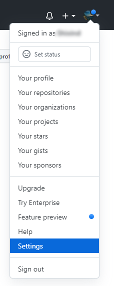
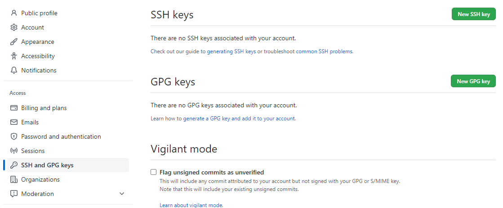
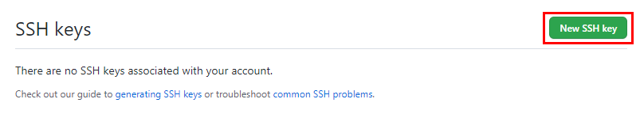
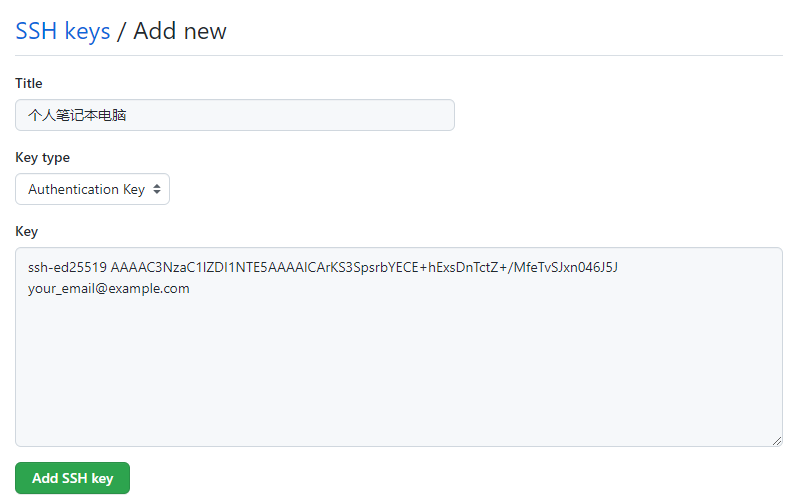
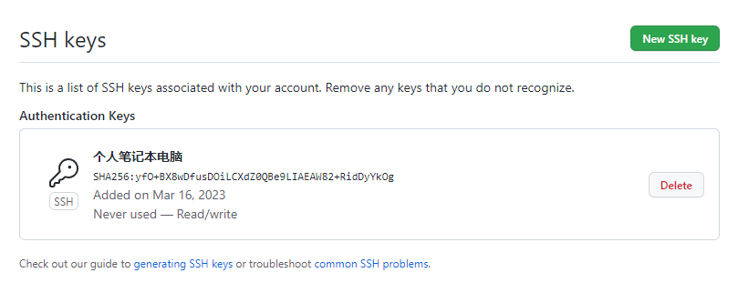

> 参考链接：[docs.github.com](https://docs.github.com/zh/authentication/connecting-to-github-with-ssh/generating-a-new-ssh-key-and-adding-it-to-the-ssh-agent)


## 一、生成新的 SSH 密钥

1. 打开终端，粘贴下面的文本（替换为您的 GitHub 电子邮件地址）。

```sh
$ ssh-keygen -t ed25519 -C "your_email@example.com"
```

这将以提供的电子邮件地址为标签创建新 SSH 密钥。

```sh
> Generating public/private ed25519 key pair.
```

当系统提示您 “Enter a file in which to save the key（输入要保存密钥的文件）” 时，可以按 Enter 键接受默认文件位置。

```sh
> Enter a file in which to save the key (/home/YOU/.ssh/ALGORITHM):[Press enter]
```

请注意，如果以前创建了 SSH 密钥，则 ssh-keygen 可能会要求重写另一个密钥，在这种情况下，我们建议创建自定义命名的 SSH 密钥。 为此，请键入默认文件位置，并将 id_ssh_keyname 替换为自定义密钥名称。


2. 在提示符下，键入安全密码。
```sh
> Enter passphrase (empty for no passphrase): [Type a passphrase]
> Enter same passphrase again: [Type passphrase again]
```


## 二、将 SSH 密钥添加到 ssh-agent

1. 在后台启动 ssh 代理。

```sh
$ eval "$(ssh-agent -s)"
> Agent pid 59566
```

根据您的环境，您可能需要使用不同的命令。 例如，在启动 ssh-agent 之前，你可能需要通过运行 `sudo -s -H` 根访问，或者可能需要使用 `exec ssh-agent bash` 或 `exec ssh-agent zsh` 运行 ssh-agent。


2. 将 SSH 私钥添加到 ssh-agent。 如果使用其他名称创建了密钥或要添加具有其他名称的现有密钥，请将命令中的 id_ed25519 替换为私钥文件的名称。

```sh
$ ssh-add ~/.ssh/id_ed25519
```


## 三、将 SSH 密钥添加到 Github 账户

1. 将 SSH 公钥复制到剪贴板

```sh
$ cat ~/.ssh/id_ed25519.pub
```

> 提示：你也可以找到隐藏的 .ssh 文件夹，在你最喜欢的文本编辑器中打开该文件，并将其复制到剪贴板。

在任何页面的右上角，单击个人资料照片，然后单击“设置”。




1. 在边栏的“访问”部分中，单击 “SSH 和 GPG 密钥”。




3. 单击“新建 SSH 密钥”或“添加 SSH 密钥” 。




4. 将公钥粘贴到“密钥”字段。



- 在 "Title"（标题）字段中，为新密钥添加描述性标签。 例如，如果使用的是个人笔记本电脑，则可以将此密钥称为“个人笔记本电脑”。
- 选择密钥类型（身份验证或签名）。


5. 单击“添加 SSH 密钥”。

>提示：可能会需要输入密码进行身份确认。





## 四、测试 SSH 连接

1. 打开终端，输入以下内容：

```sh
$ ssh -T git@github.com
```

您可能会看到类似如下的警告：

```sh
> The authenticity of host 'github.com (IP ADDRESS)' can't be established.
> RSA key fingerprint is SHA256:nThbg6kXUpJWGl7E1IGOCspRomTxdCARLviKw6E5SY8.
> Are you sure you want to continue connecting (yes/no)?
```


2. 验证所看到消息中的指纹是否与 GitHub 的公钥指纹匹配。 如果是，则键入 yes：

输入密钥密码（如果有）

```sh
> Enter passphrase for key '/home/YOU/.ssh/id_ed25519':[Type a passphrase]
```

连接成功返回以下输出

```sh
> Hi USERNAME! You've successfully authenticated, but GitHub does not provide shell access.
```
