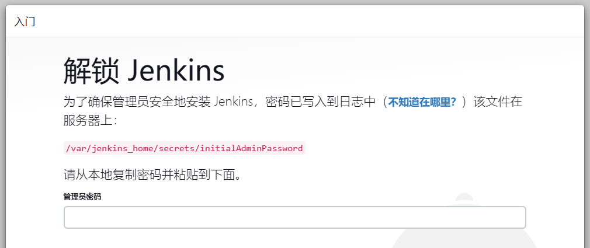
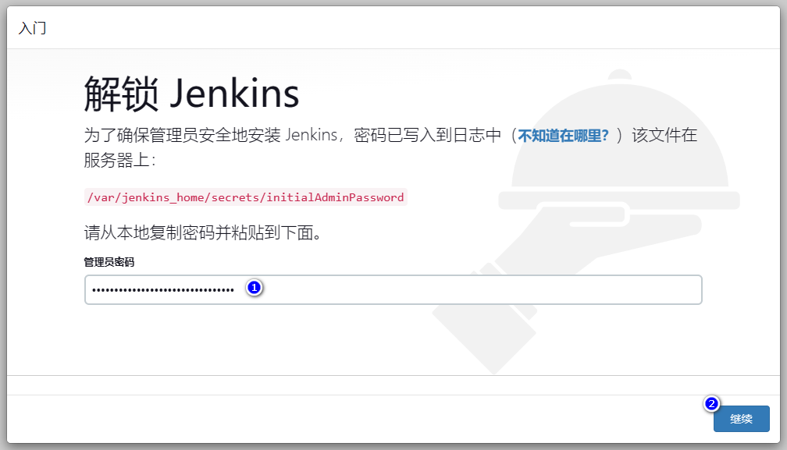

本文主要介绍如何使用 docker 搭建 jenkins。


## 先决条件

假设您的系统已安装了 Docker 或 Docker Desktop。


## 拉取 jenkins 镜像

jenkins 镜像网址：[https://hub.docker.com/_/jenkins](https://hub.docker.com/_/jenkins)

```sh
docker pull jenkins/jenkins:lts
```


## 启动 jenkins 容器
```sh
docker run --name=jenkins -p 8888:8080 -v /your/home:/var/jenkins_home -d jenkins/jenkins:lts
```

参数解释：
|参数|描述|
|:---|:---|
|--name=jenkins|指定容器名称为：jenkins|
|-p 8888:8080|端口映射。<br>将容器的8080端口映射到宿主机的8888端口|
|-v /your/home:/var/jenkins_home|目录挂载。<br>将宿主机的 `/your/home` 目录挂载到容器的 `/var/jenkins_home` 目录|
|-d|后台运行容器|
|jenkins/jenkins:lts|使用的镜像|


## 本地访问 jenkins

1. 浏览器访问 `http://127.0.0.1:8888`，出现如下页面：


等待 jenkins 初始化完毕后，会提示解锁 jenkins：



按照提示从 `/var/jenkins_home/secrets/initialAdminPassword` 文件中获取解锁密钥：
```sh
# 进入容器
docker exec -it jenkins /bin/bash
# 查看密码文件
cat /var/jenkins_home/secrets/initialAdminPassword

# Output
aef8c4568aab4d97a25c2dff6b8e8261
```

或者，使用 `docker logs` 命令查看解锁密钥：
```sh
docker logs jenkins

# Output
...
2023-03-18 06:18:17.473+0000 [id=45]    INFO    jenkins.install.SetupWizard#init:

*************************************************************
*************************************************************
*************************************************************

Jenkins initial setup is required. An admin user has been created and a password generated.
Please use the following password to proceed to installation:

aef8c4568aab4d97a25c2dff6b8e8261

This may also be found at: /var/jenkins_home/secrets/initialAdminPassword

*************************************************************
*************************************************************
*************************************************************

2023-03-18 06:19:41.500+0000 [id=56]    INFO    jenkins.InitReactorRunner$1#onAttained: Completed initialization
2023-03-18 06:19:41.563+0000 [id=32]    INFO    hudson.lifecycle.Lifecycle#onReady: Jenkins is fully up and running
2023-03-18 06:19:42.731+0000 [id=84]    INFO    h.m.DownloadService$Downloadable#load: Obtained the updated data file for hudson.tasks.Maven.MavenInstaller
2023-03-18 06:19:42.732+0000 [id=84]    INFO    hudson.util.Retrier#start: Performed the action check updates server successfully at the attempt #1
```


2. 输入密钥解锁 jenkins



解锁完成后，会进入插件安装页面。这里选择 `安装推荐插件`：


接下来等待插件安装完毕即可。


> 如果部分插件安装失败，可以跳过这部分，后续再安装上去即可。


3. 创建管理员账号

这里是配置 jenkins 超级管理员的账户和密码。


> jenkins 默认包含一个账户名为 admin 的超级管理员，密码为站点的解锁密钥。

- 如果选择 `使用admin账户继续`，系统会使用默认的admin账户进行后续操作。
- 如果选择 `保存并完成`，系统会根据填写的信息创建一个超级管理员账户进行后续操作。


4. 配置 jenkins URL

这里是配置 jenkins 的访问链接。


> 如果有需要外部访问的情况，最好配置一下该 URL。

这里点击 `保存并完成` 进入下一步。


5. 至此，jenkins 已搭建完成。


## 总结

根据 Jenkins 的安装向导进行操作即可简单的完成搭建。

如果遇到插件安装不上的问题，也可以在jenkins搭建完成后再去[安装插件]()。
