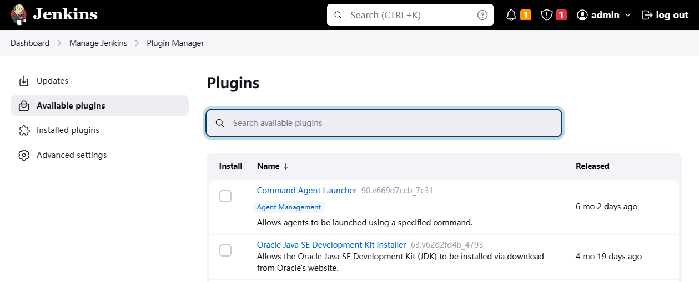
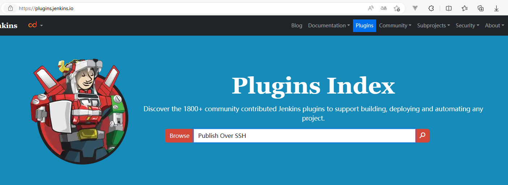
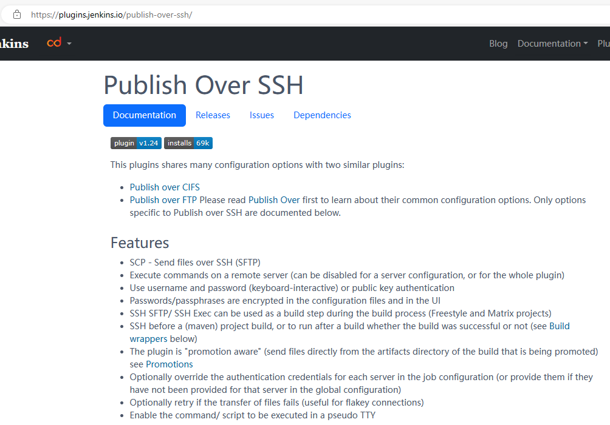
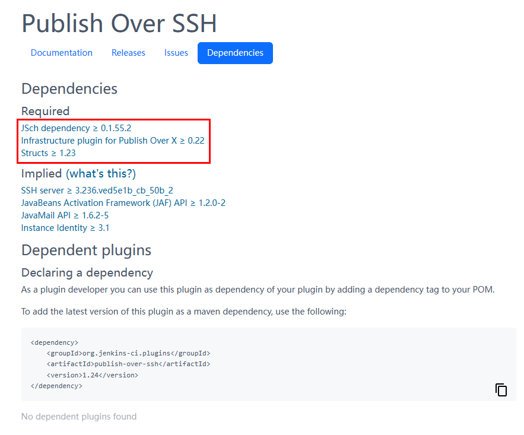
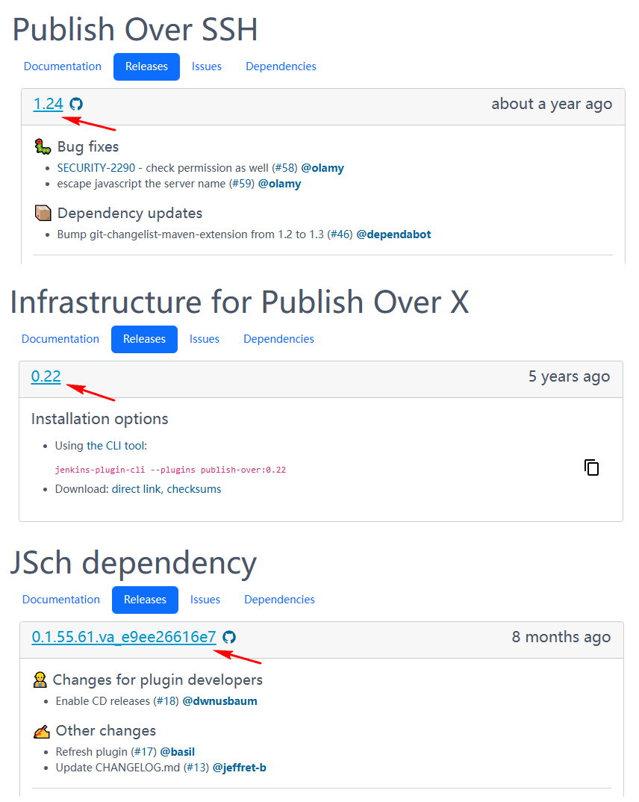
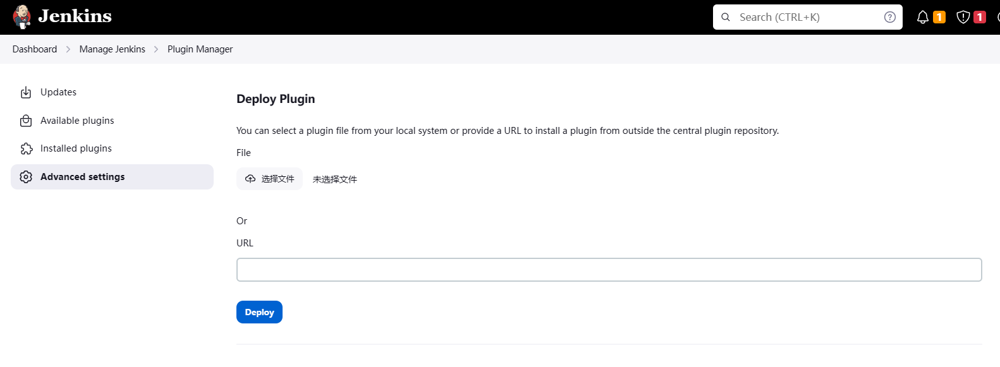
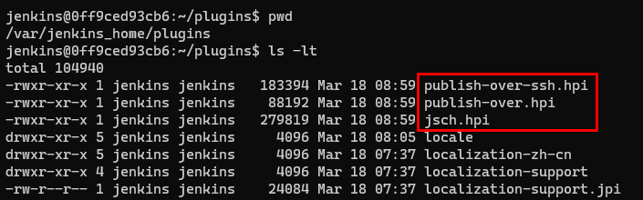

在 Jenkins 的安装向导页面中，会有一步是否安装推荐的插件，可以直接进行安装，也可以跳过。

Jenkins 插件安装分为在线安装和离线安装两种类型， 离线安装又可以有多种方式。

不管以那种方式安装插件，安装完成后一般都需要重新启动 jenkins。

## 在线安装

在 Jenkins 的插件管理页面直接搜索安装。如下图：

安装要求是机器必须联网，在这个页面可以进行安装，也可以直接卸载和升级。其他方式安装的插件也是在这里管理。

Jenkins 插件之间有依赖关系，如果某个插件需要使用到其他的插件（存在依赖状况），自动安装会一并安装依赖的插件。

## 离线安装

离线安装就是先把插件文件通过其他机器下载下来，再上传到Jenkins的服务器。因为插件存在依赖，所以需要把依赖的插件一并下载。

### 插件下载

在 [https://plugins.jenkins.io/](https://plugins.jenkins.io/) 中查询需要的插件，这里以 `Publish Over SSH` 插件为例：

点击搜索，选择并进入插件介绍页：

- Documention  标签页对该插件的介绍。
- Releases     提供了各版本的下载链接。
- Issues       插件的问题列表。
- Dependencies 则是该插件关联的插件。

Required 为依赖的插件，必须一并下载，否则无法安装。另外，插件的依赖也有多层次的状况，也就是A依赖B, B依赖C， 则安装A同时需要B和C。

如下图，`Publish Over SSH` 插件依赖 `JSch dependency`、`Infrastructure plugin for Publish Over X` 和 `Structs` 这三个插件：

其中 `Structs` 系统默认已安装，且 `JSch dependency` 和 `Infrastructure plugin for Publish Over X` 插件没有再依赖其他的插件，所以这两个插件是要下载的。

根据依赖要求，下载对应版本的插件。

Jenkins 的插件的文件后缀名有两种格式 `.jpi` 和 `.hpi`。

`jpi` 的 j 就是Jenkins, `hpi` 的h 是 Hudson。 Jenkins项目的前身是Hudson。

 

获取插件文件后，安装插件的方式有两种：

### 安装方式一

在插件管理页面， 进入 `Advanced settings` 标签页， 拉到下方的 `Deploy Plugin`， 选择插件文件并上传。如下图：

因为只支持单文件上传，所以需要按依赖顺序一个一个的上传插件。

### 安装方式二

直接将插件文件复制到Jenkins工作目录的 plugins 目录，如下图：

插件文件拷贝过去后，需要修改权限并且重启 jenkins。
