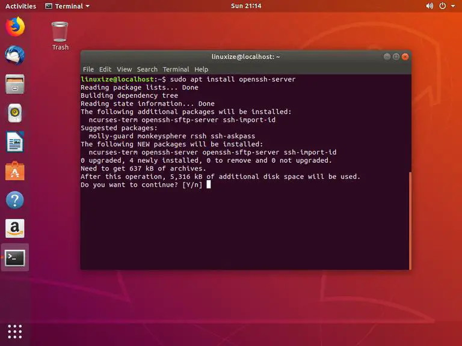
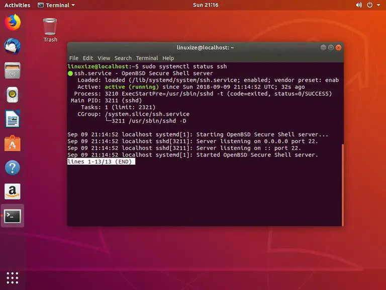
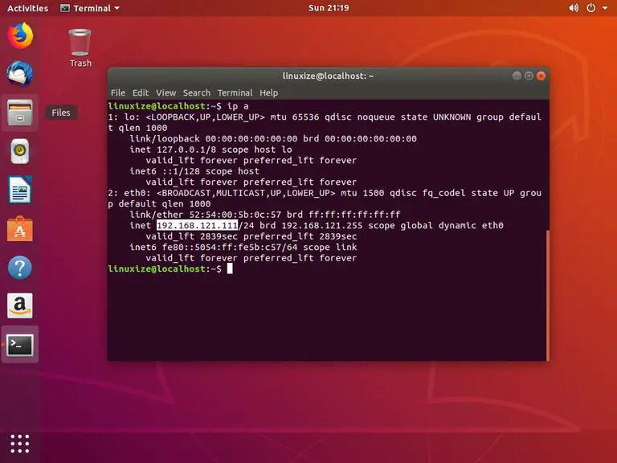
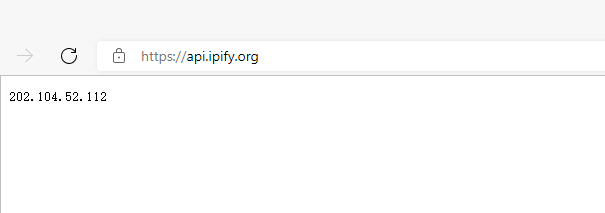

本文转载：[https://linuxize.com/post/how-to-enable-ssh-on-ubuntu-18-04/](https://linuxize.com/post/how-to-enable-ssh-on-ubuntu-18-04/)

Secure Shell (SSH) 是用于客户端和服务端之间安全连接的网络协议, 服务端和客户端之间的每次交互均被加密。

启用SSH服务将允许您远程连接到系统执行并管理任务。您还可以通过scp和sftp命令来传输拷贝文件。


## 先决条件

在继续本教程之前，请确保您以具有 sudo 权限的用户身份登录。


## 在 Ubuntu 上启用 SSH

默认情况下，当你安装完Ubuntu系统后，系统是不允许通过SSH进行远程访问的，您需要安装OpenSSH并启用它。

1. 安装 openssh-server 软件包:

```sh
sudo apt update
sudo apt install openssh-server
```

出现提示时输入密码，然后输入 `Y` 以继续安装。




2. 安装完成后，SSH 服务将自动启动。如果需要验证安装是否成功以及 SSH 服务是否正在运行，请键入以下命令，该命令将打印 SSH 服务器状态：

```sh
sudo systemctl status ssh

#OR
sudo service ssh status
```



按下 `q` 可返回命令行提示符。


3. Ubuntu带有一个名为UFW的防火墙配置工具。如果系统上启用了防火墙，请确保打开 SSH 端口：

```sh
sudo ufw allow ssh
```

现在SSH已安装并在您的Ubuntu系统上运行，您可以通过SSH从任何远程计算机连接到它。Linux 和 macOS 系统默认安装了 SSH 客户端。如果要从Windows计算机进行连接，则可以使用SSH客户端，例如[PuTTY](https://www.putty.org/)。


## 通过局域网连接到 SSH

要通过局域网连接到您的 Ubuntu 机器，您只需输入以下命令：

```
ssh username@ip_address
```

> 使用实际用户名和安装 SSH 的 Ubuntu 计算机的 IP 地址更改 username@ip_address

如果您不知道您的IP地址，可以使用 [ip命令](https://linuxize.com/post/linux-ip-command/) 轻松找到它：

```sh
ip a
```



从输出中可以看出，系统 IP 地址为 。192.168.121.111

找到 IP 地址后，通过运行以下 ssh 命令登录到远程计算机：

```sh
ssh linuxize@192.168.121.111
```

首次通过 SSH 连接时，您将看到如下所示的消息：

```
The authenticity of host '192.168.121.111 (192.168.121.111)' can't be established.
ECDSA key fingerprint is SHA256:Vybt22mVXuNuB5unE++yowF7lgA/9/2bLSiO3qmYWBY.
Are you sure you want to continue connecting (yes/no)?
```

键入 `yes`，系统将提示您输入密码。

```
Warning: Permanently added '192.168.121.111' (ECDSA) to the list of known hosts.
linuxize@192.168.121.111's password:
```

输入密码后，您将看到类似于下面的消息。

```
Welcome to Ubuntu 18.04.1 LTS (GNU/Linux 4.15.0-33-generic x86_64)

 * Documentation:  https://help.ubuntu.com
 * Management:     https://landscape.canonical.com
 * Support:        https://ubuntu.com/advantage

...
```

您现在已登录到您的 Ubuntu 机器。


## 通过互联网连接到 SSH

要通过互联网连接到您的 Ubuntu 机器，您需要知道您的公共 IP 地址，并将您的路由器配置为接受端口 22 上的数据并将其发送到运行 SSH 的 Ubuntu 机器。

要确定您尝试通过 SSH 连接到的计算机的公共 IP 地址，只需访问以下 URL：[https://api.ipify.org](https://api.ipify.org)



在设置端口转发时，每个路由器都有不同的方法来设置[端口转发](https://linuxize.com/post/how-to-setup-ssh-tunneling/)。您应该查阅路由器文档，了解如何设置端口转发。简而言之，您需要输入将发出请求的端口号（默认 SSH 端口为 22）和您之前找到的运行 SSH 的计算机的私有 IP 地址（使用命令 `ip a`）。

找到IP地址并配置路由器后，您可以通过键入以下内容登录：

```
ssh username@public_ip_address
```

如果您要将机器暴露在互联网上，最好实施一些安全措施。最基本的方法是将路由器配置为接受非标准端口上的 SSH 流量，并将其转发到运行 SSH 服务的计算机上的端口 22。

您还可以设置[基于 SSH 密钥的身份验证](https://linuxize.com/post/how-to-setup-passwordless-ssh-login/)，并在不输入密码的情况下连接到 Ubuntu 计算机。


## 在 Ubuntu 上禁用 SSH

如果出于某种原因您想在 Ubuntu 机器上禁用 SSH，您只需通过运行以下命令来停止 SSH 服务：

```sh
sudo systemctl stop ssh

# OR
sudo service ssh stop
```

要重新启动它，请运行：

```sh
sudo systemctl start ssh

# OR
sudo service ssh start
```

要禁用在系统启动运行期间启动的 SSH 服务，请执行以下操作：

```sh
sudo systemctl disable ssh
```

要再次启用它，请键入：

```sh
sudo systemctl enable ssh
```


## 总结

您已经学习了如何在 Ubuntu 18.04 上安装和启用 SSH。现在，您可以登录到计算机并通过命令提示符执行常见的系统管理任务。

默认情况下，SSH 侦听端口 22。[更改默认 SSH 端口](https://linuxize.com/post/how-to-change-ssh-port-in-linux/)可降低自动攻击的风险，从而为服务器增加额外的安全层。
